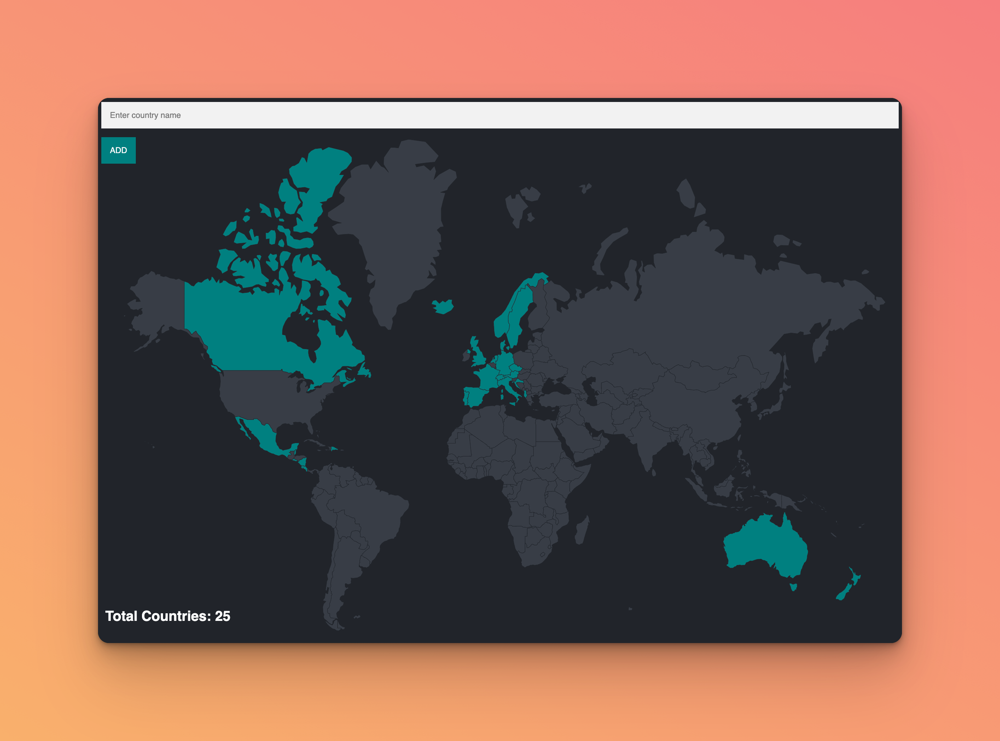

# Travel Tracker

## Description

Travel Tracker is an engaging web application designed for users to track and visualize the countries they have visited. It leverages Express.js and PostgreSQL, incorporating external data files for comprehensive country information. The application features an interactive map interface, enabling users to dynamically update their travel records.



## Key Learnings

- **Database Integration with PostgreSQL**: Learned to integrate a PostgreSQL database with a Node.js application using the `pg` module.
- **Handling External Data Files**: Gained experience in processing and utilizing external CSV files to populate the PostgreSQL database.
- **Express.js and Server-Side Rendering**: Developed skills inusing Express.js for backend development and EJS for server-side rendering dynamically updating web pages based on user interactions and database changes.
  -- **Asynchronous Programming in Node.js**: Enhanced understanding of asynchronous JavaScript, handling database queries and HTTP requests effectively.
- **Form Handling and Data Validation**: Learned to manage form submissions, validate user input, and handle errors gracefully.
- **Dynamic Content Rendering**: Practiced rendering content dynamically on the frontend based on backend data, enhancing the interactivity of the web application.

## Installation

1. Clone the repository:

```bash
git clone https://github.com/lappemic/udemy-travel-tracker.git
cd udemy-travel-tracker
```

2. Install dependencies:

```bash
npm install
```

3. Set up a PostgreSQL database named world and create the necessary tables with appropriate data.

## Usage

1. Start the server:

```bash
node index.js
```

or with nodemon:

```bash
nodemon index.js
```

This will start the server on port 3000.

Navigate to http://localhost:3000 in your browser to play the game.

## Project Structure

index.js: Main server file containing backend logic and database interactions.
views/index.ejs: EJS template for the quiz frontend.
public/styles/main.css: CSS file for frontend styling.
